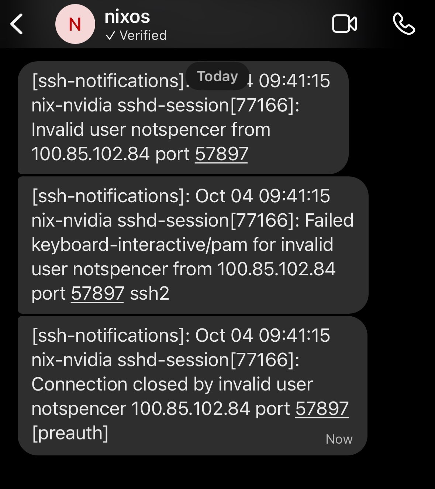
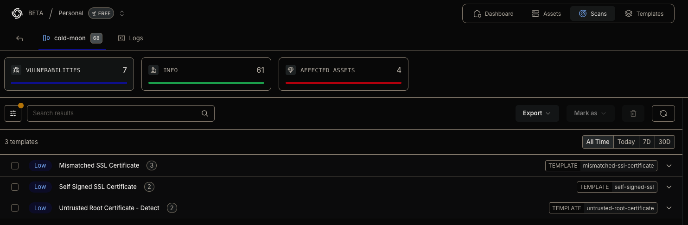

# Introduction to Nix

_Thoughts on Nix for increased productivity and security_

By: Spencer Heywood ([heywoodlh](https://github.com/heywoodlh))

<sup><sub><small>Spencer Heywood is an MIT Lincoln Laboratory employee; no Laboratory funding or resources were used to produce the findings/results in this presentation</small></sub></sup>

---

Source code for this presentation:

[https://github.com/heywoodlh/SAINTCON-2024](https://github.com/heywoodlh/SAINTCON-2024)

Warning: I have a lot of links in my presentation, so definitely look at the source.

---

# My journey with Nix so far

Discovered ~2018 while looking for a Homebrew alternative

Use Nix to fully manage my machines (MacOS, Linux)

Recent Nixpkgs contributor

---

# What is Nix?

"Nix" can mean a few things. Here's how I refer to Nix things:
- Nix: the package manager/programming language
- NixOS: the Linux distribution
- Nix-Darwin: NixOS-like MacOS management tool
- Nixpkgs: the repository for all of Nix's packages

---
<!-- footer: what is nix -->

## Installing Nix (MacOS, Linux)

The official instructions from [nixos.org](https://nixos.org) are below.

Linux (non-NixOS):

```
sh <(curl -L https://nixos.org/nix/install) --daemon
```

MacOS:

```
sh <(curl -L https://nixos.org/nix/install)
```

<sup><sub><small>Please always look at installers before running them.</small></sub></sup>

---

I prefer using the Determinate Systems Nix Installer for its UX and defaults:

[https://github.com/DeterminateSystems/nix-installer](https://github.com/DeterminateSystems/nix-installer)

```
curl --proto '=https' --tlsv1.2 -sSf -L https://install.determinate.systems/nix | sh -s -- install
```

---

## I use Nix flakes

I use a non-default feature in Nix called "flakes".

> Flakes are the unit for packaging Nix code in a reproducible and discoverable way.

The commands in my presentation will assume the usage of flakes.

To turn on flakes, place the following in `~/.config/nix/nix.conf`:

```
extra-experimental-features = nix-command flakes
```

---

## Try Nix out without installing it!

If you want to try out Nix with flakes but don't want to install Nix, try it with Docker:

```
docker run -it --rm docker.io/heywoodlh/nix:2.21.2
```

The commands in the rest of my presentation should work in the container.

---

## Nix the package manager

Nix can be used standalone as a package manager:

```
❯ nix profile install nixpkgs#curl
```

> All packages defined in nixpkgs are listed here: [https://search.nixos.org](https://search.nixos.org)

Search for a package in `nixpkgs` (this may take a while the first time):

```
nix search nixpkgs curl
```

Additionally, Nix can run packages without installing them permanently:

```
❯ which hello

❯ nix run nixpkgs#hello
Hello, world!
```

---

Clean up unused content every once in a while:

```
nix-collect-garbage --delete-old
```

Start up a shell session with multiple temporary packages:

```
❯ nix shell nixpkgs#nmap nixpkgs#masscan

❯ which nmap
/nix/store/7c5ga6552rb6rymk3r64sq848k15084w-nmap-7.95/bin/nmap
```

---

## What is that crazy /nix/store path?

```
❯ which nmap
/nix/store/7c5ga6552rb6rymk3r64sq848k15084w-nmap-7.95/bin/nmap
```

Example, if package A requires package B:
- package B will be installed to `/nix/store/<something>-package-b`
- package A will be installed to `/nix/store/<something>-package-a`
- installation logic will ensure package A references package B's location in the store

---

## Nix the language

Nix provides a functional programming language that is paired with the package manager.

Some recommendations if you're getting started with Nix programming:
- Learn how to use `nix repl` (I'm still not very good at this)
- Look at examples similar to what you're trying to accomplish
- Implement Nix language awareness in your text editor
- Ask more experienced Nix users for help when you hit a roadblock

---

## Some Nix flake jargon

### Inputs

"Inputs" are anything outside of your flake that you are consuming (usually other flakes).

In a `flake.nix`, I might define inputs like this:

```
  inputs = {
    nixpkgs.url = "github:nixos/nixpkgs/nixpkgs-unstable";
    somefile = {
      url = "https://example.com/file.txt";
      flake = false;
    };
  }
```

---

<!-- footer: nix flakes -->

### Outputs

"Outputs" are things you're producing with your flake:

```
  outputs = { self, nixpkgs, somefile }: let
    pkgs = nixpkgs.legacyPackages.x86_64-linux;
  in {
    devShells.x86_64-linux.default = pkgs.mkShell {
      name = "some-shell-environment";
      buildInputs = [
        pkgs.masscan
        pkgs.nmap
      ];
    };
  };
```

---

Here's a small, complete flake that defines a shell environment named `default`:

```
{
  description = "An example Linux security tool flake";
  inputs.nixpkgs.url = "github:nixos/nixpkgs/nixpkgs-unstable";

  outputs = { self, nixpkgs }:
  let pkgs = nixpkgs.legacyPackages.x86_64-linux;
  in {
    devShells.x86_64-linux.default = pkgs.mkShell {
      name = "security-env";
      buildInputs = [
        pkgs.masscan
        pkgs.nmap
      ];
    };
  };
}
```

You would use this `flake.nix` by running `nix develop .#`.

---

The previous flake example was exclusive to `x86_64-linux`, but most packages in Nix are available for the following:
- `x86_64-linux`: Intel/AMD Linux
- `aarch64-linux`: ARM64 Linux
- `x86_64-darwin`: Intel MacOS
- `aarch64-darwin`: Apple Silicon MacOS

Some tools exist to make cross-platform flakes easier to create:
- [Flake Parts](https://flake.parts/)
- [flake-utils](https://github.com/numtide/flake-utils)

---

## NixOS

NixOS uses Nix to actualize configuration in `/etc/nixos/configuration.nix`.

For example, to deploy a Minecraft Server, add the following to your configuration file:

```
services.minecraft-server = {
  enable = true;
  eula = true; #accept the EULA
  openFirewall = true;
};
```

And then it would be deployed after the `nixos-rebuild` command completes:

```
sudo nixos-rebuild switch
```

---

All NixOS options are listed here: [https://search.nixos.org/options](https://search.nixos.org/options)

You can also run `man configuration.nix` on a live NixOS system to see all options.

---

## My NixOS pros vs cons list:

Pros:
- Selective ability to be rolling release or LTS release
- Codified system configuration offered by default
- Immutable, reproducible systems are (usually) more stable and secure

Cons:
- NixOS system-configurations don't translate to other Linux distributions
- Many tools don't know how to handle `/nix` and immutable systems
- Reproducibility can be bad for disk space

Ultimately, I do not think NixOS makes sense in all environments.

<sup><sub><small>I do not consider these applicable points for Nix the package manager</small></sub></sup>

---

## Other cool Nix implementations

### Nix-Darwin

Nix-Darwin brings most of the same benefits of NixOS to MacOS.

### Home-Manager

Home-Manager provides cross-platform declarative dotfile management with Nix.

---

# Nix for Security

---
<!-- footer: nix for security -->

## Red Team

As the largest package repository, Nix has plenty of offensive security tools.

Some tools I've used with Nix:

[Metasploit](https://search.nixos.org/packages?channel=unstable&from=0&size=50&sort=relevance&type=packages&query=metasploit)
[Aircrack-ng](https://search.nixos.org/packages?channel=unstable&show=aircrack-ng&from=0&size=50&sort=relevance&type=packages&query=aircrack-ng)
[Ghidra](https://search.nixos.org/packages?channel=unstable&from=0&size=50&sort=relevance&type=packages&query=ghidra)

A more complete picture of the state of nixpkgs/NixOS for red-teaming can be found here:

NixOS for Pentesting Overview: [https://github.com/NixOS/nixpkgs/issues/81418](https://github.com/NixOS/nixpkgs/issues/81418)

---

## Blue Team

I think the implications for Nix in a blue team context are even more interesting:
- Nixpkgs' unstable branch is updated frequently
- Declarative, reproducible builds for improved auditability
- Write a configuration once, re-use as often as desired

---

## Example 1: NixOS SSH alerts

I get a push notification when a successful or failed login attempt occurs via SSH:

[github:heywoodlh/nixos-configs - nixos/roles/security/sshd-monitor.nix](https://github.com/heywoodlh/nixos-configs/blob/caa74bbf0412a73d15eefaa208608c7cf953b72e/nixos/roles/security/sshd-monitor.nix)

```
  sshd-monitor = pkgs.writeScript "sshd-monitor" ''
    #!/usr/bin/env bash
    service="sshd.service"

    ### Pattern to match with `grep -E ...`
    grep_regex_pattern='Failed password|Invalid verification code|Invalid user|Accepted publickey|Accepted password|Accepted keyboard-interactive'

    ### Pattern to exclude with `grep -v -E ...`
    grep_exclude_regex_pattern=''

    ## Tail sshd.service Journald output
    journalctl -u "''${service}" -n 0 -f \
      | grep --line-buffered -iE "''${grep_regex_pattern}" \
      | grep --line-buffered -ivE "''${grep_exclude_regex_pattern}" \
      | while read line
        do
          ${pkgs.curl}/bin/curl -d "''${line}" http://ntfy/ssh-notifications
        done
  '';
```

---

Final result:

<center></center>

---

In case you're wondering how those NTFY notifications get to Signal:
- [github:heywoodlh/signal-ntfy-mirror](https://github.com/heywoodlh/signal-ntfy-mirror)
- [github:heywoodlh/nixos-configs: mirroring plex and ssh notifications to signal](https://github.com/heywoodlh/nixos-configs/commit/89d8c1a)

---

## Example 2: Other NixOS configurations

Graylog: [github:heywoodlh/nixos-configs - nixos/roles/monitoring/graylog.nix](https://github.com/heywoodlh/nixos-configs/blob/caa74bbf0412a73d15eefaa208608c7cf953b72e/nixos/roles/monitoring/graylog.nix)

Syslog-ng server: [github:heywoodlh/nixos-configs - nixos/roles/monitoring/syslog-ng/server.nix](https://github.com/heywoodlh/nixos-configs/blob/caa74bbf0412a73d15eefaa208608c7cf953b72e/nixos/roles/monitoring/syslog-ng/server.nix)

Syslog-ng client: [github:heywoodlh/nixos-configs - nixos/roles/monitoring/syslog-ng/client.nix](https://github.com/heywoodlh/nixos-configs/blob/caa74bbf0412a73d15eefaa208608c7cf953b72e/nixos/roles/monitoring/syslog-ng/client.nix)

Netflow nfcapd collector: [github:heywoodlh/nixos-configs - nixos/roles/monitoring/nfcapd.nix](https://github.com/heywoodlh/nixos-configs/blob/caa74bbf0412a73d15eefaa208608c7cf953b72e/nixos/roles/monitoring/nfcapd.nix)

---

## Example 3: Kubernetes vulnerability scanning with Nuclei

I use Nix to template my Kubernetes deployments.

Inspect my automated Nuclei vulnerability scanning deployment with these commands:

```
nix build -o ./nuclei.yaml "github:heywoodlh/flakes?dir=kube#nuclei"
cat ./nuclei.yaml
```

Plus, I use Renovate to parse `kube/flake.nix` in that repo to suggest updates to images:

[github:heywoodlh/flakes - renovate.json#L8-L17](https://github.com/heywoodlh/flakes/blob/f8980a3de6c12d481826ab451c21861c449be88b/renovate.json#L8-L17)

---

Nuclei scans in Project Discovery dashboard


<center></center>

---

## Example 4: This presentation!

This presentation is a flake. Launch it in your default browser with this command:

```
nix run "github:heywoodlh/SAINTCON-2024"
```

Or render the slides (will be placed in `./result/intro-to-nix.html`):

```
nix build -o result "github:heywoodlh/SAINTCON-2024#presentation"
```

---

## Verdict

Nix is awesome and there aren't many tools like it.

---

## Questions?

---

Thanks!

